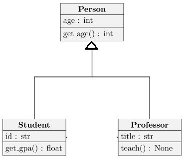
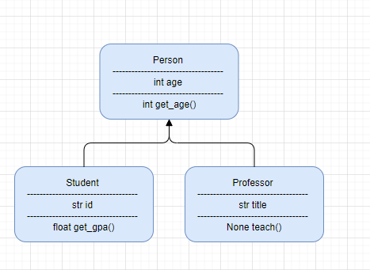
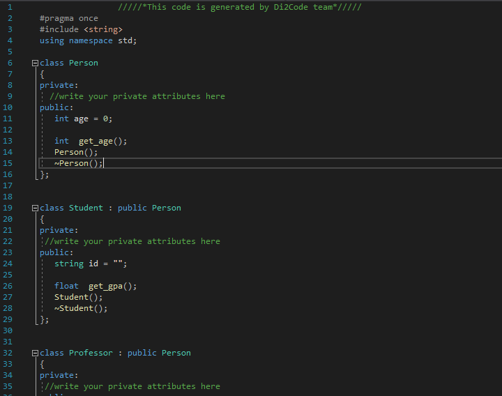
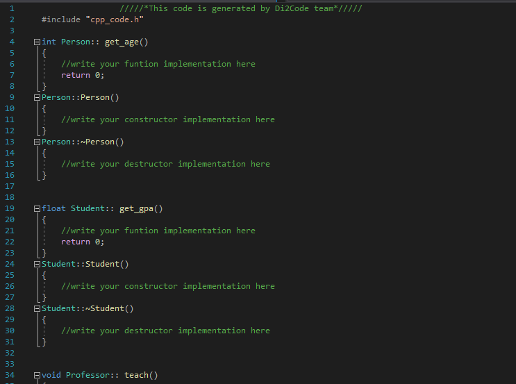
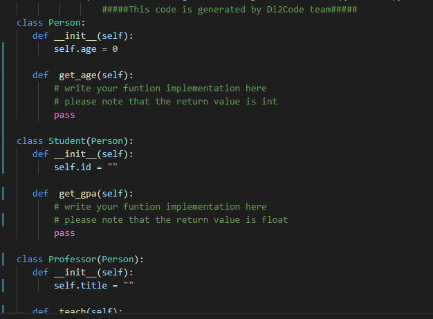
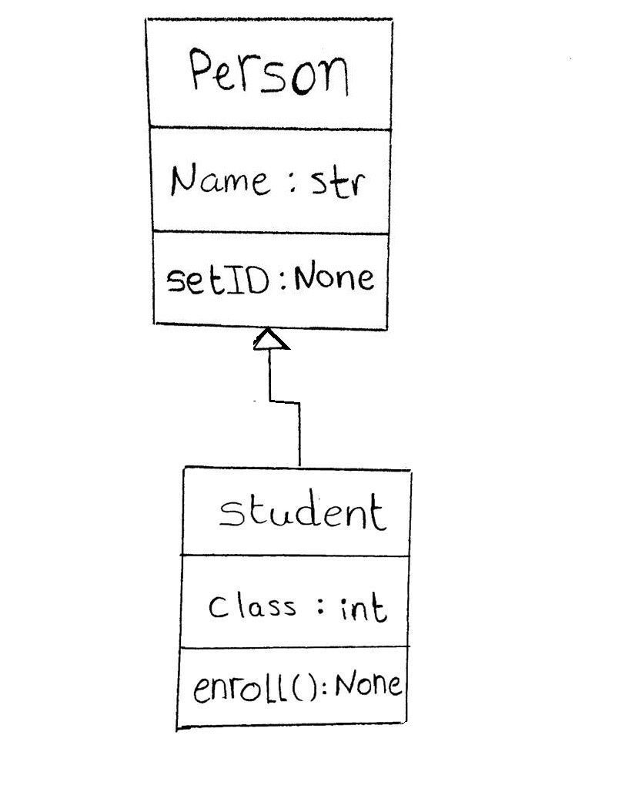
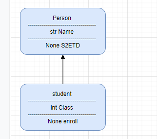
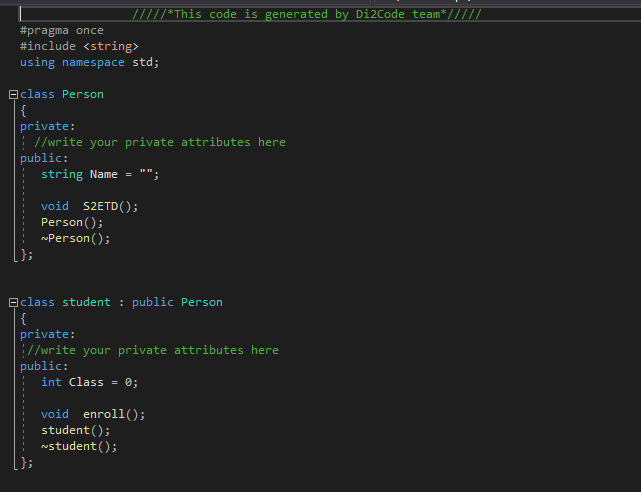
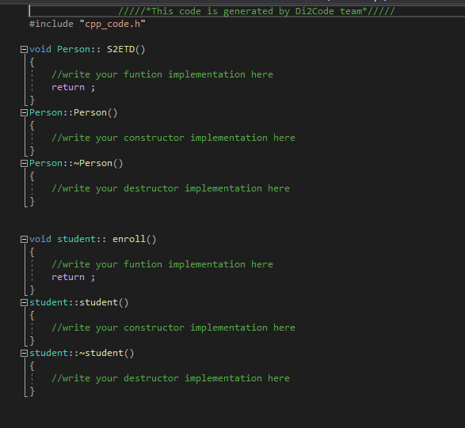
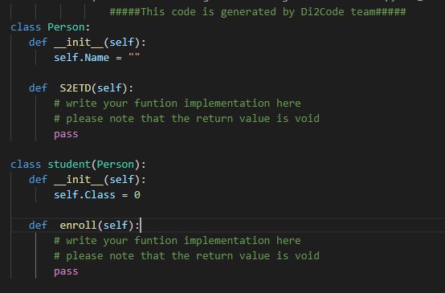

# Di2Code-Diagram-to-Code

As software engineers, we use Unified Modeling Language (UML) almostconstantly.

Class diagram in (UML) is a type of static structure diagram that describes the structure of a system by showing the system's classes, their attributes, operations (or methods), and the relationships among objects.

We generally draw this diagram by hand. Then spend quite some time to convert it to computer-made diagrams using any tool and then spend time to convert that specific diagram into a code using any specified programming language.

This is where our project comes to rescue, Our Goal is to help software engineers save time and effort by doing all the hard work for them. All by capturing a photo of their hand-written class diagram , we will be able to draw it and convert it to code. Sounds magical, right?

## Input and Output Samples

### First: computerized image sample 
#### Input                                             
   

 #### Diagram on draw.io

#### generated cpp code (.h file)                     
    

#### generated cpp code (.cpp file)
    

#### generated python code
    

### Second: handwritten image sample 
#### Input                                             

 #### Diagram on draw.io

#### generated cpp code (.h file)                     
    

#### generated cpp code (.cpp file)
    

#### generated python code
    

